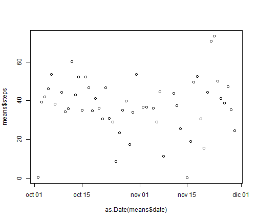
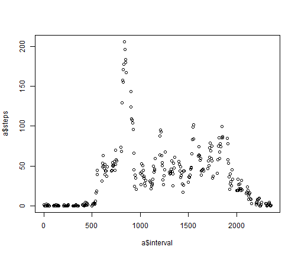
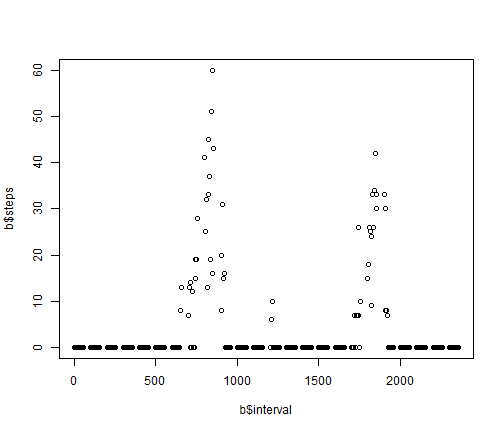

#Activity
========================================================

Lets assume we are already in the working directory where de data file is located.

##Loading data

Creating a data frame to perform the analisys:

```r
data<-read.csv('activity.csv',sep=",")
dat<-data[complete.cases(data),]
```

## Working with time
 We need to show the data sequentialy, to do so we will add a new column in the right format for further ploting:


```r
dat$date<-strftime(dat$date,format="%Y-%m-%d")
dat<-cbind(dat,format(as.Date(dat$date), "%w"))
colnames(dat)[4]<-"weekday"
```

 
## Compute de mean and median in each day and plotting it


```r
install.packages("plyr")
```

```
## Installing package into 'C:/Users/kacto/Documents/R/win-library/3.0'
## (as 'lib' is unspecified)
```

```
## Error: trying to use CRAN without setting a mirror
```

```r
library (plyr)
means<-ddply(dat, .(date), colwise(mean, .(steps)))
```


```r
plot(as.Date(means$date),means$steps)
```

 


```r
medians<-ddply(dat, .(date), colwise(mean, .(steps)))
```


```r
plot(as.Date(means$date),means$steps)
```

 


```r
a<-ddply(dat, .(interval), colwise(mean, .(steps)))
```


```r
plot(a$interval,a$steps)
```

 


```r
b<-ddply(dat, .(interval), colwise(median, .(steps)))
```


```r
plot(b$interval,b$steps)
```

 

 

